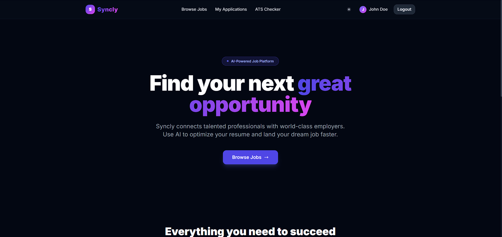
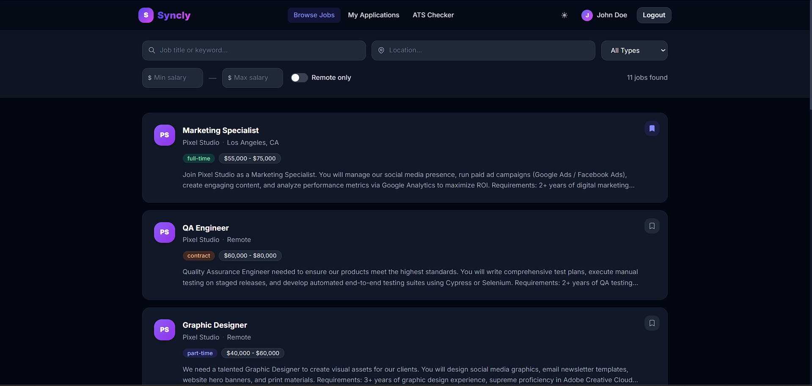
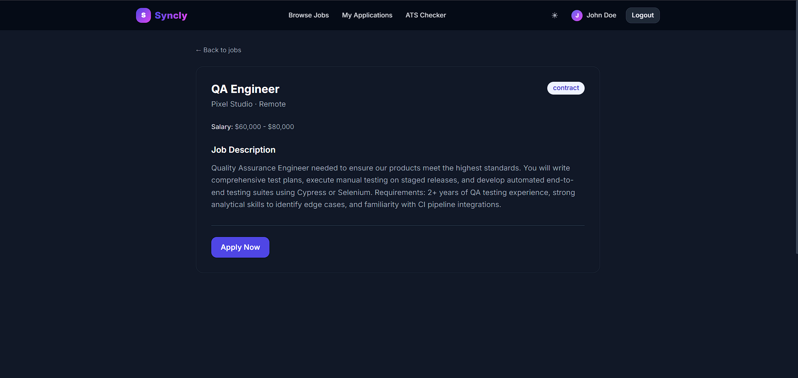
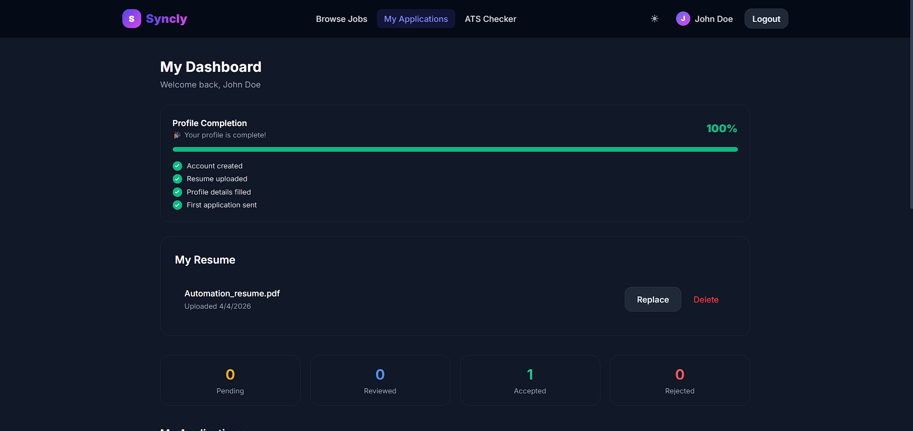
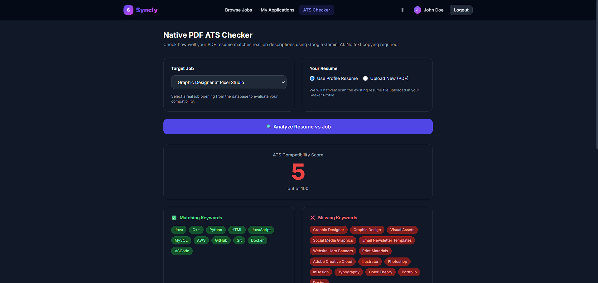
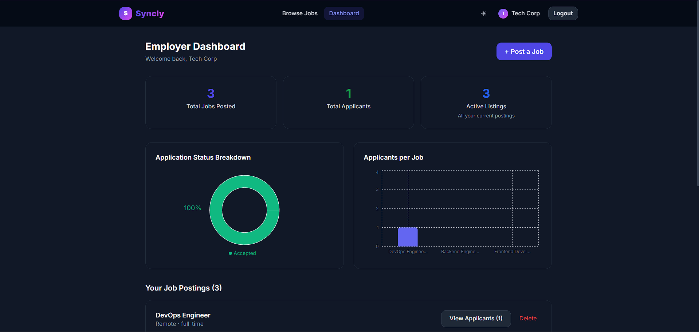
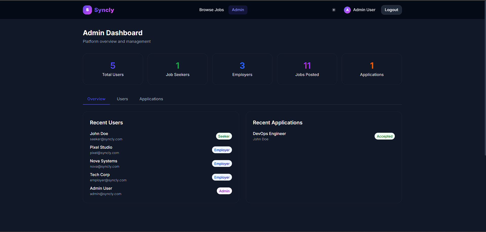
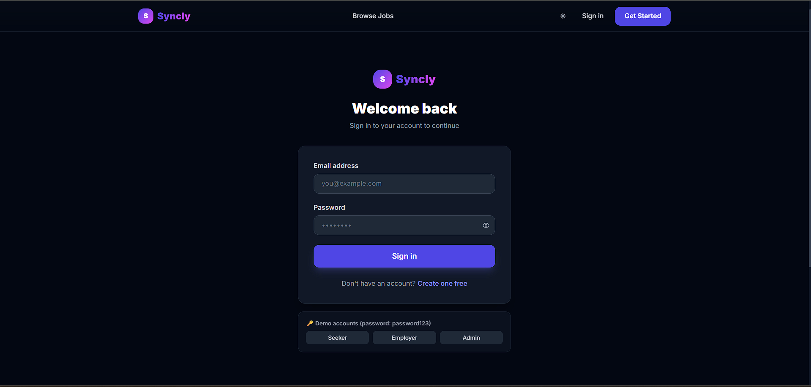

# Syncly — AI-Powered Job Search Platform

A full-stack job search and recruitment platform built with React, Node.js, and PostgreSQL. Features AI-powered resume analysis, advanced job filtering, role-based dashboards, and dark mode support.

---

## 📋 Table of Contents

- [Features](#features)
- [Tech Stack](#tech-stack)
- [Prerequisites](#prerequisites)
- [Installation](#installation)
- [Environment Variables](#environment-variables)
- [Database Setup](#database-setup)
- [Running the Application](#running-the-application)
- [Project Structure](#project-structure)
- [API Endpoints](#api-endpoints)
- [Demo Accounts](#demo-accounts)
- [Screenshots](#screenshots)
- [Future Enhancements](#future-enhancements)
- [Contributing](#contributing)
- [License](#license)

---

## ✨ Features

### For Job Seekers
- **Smart Job Search** — Advanced filtering by title, location, salary range, job type, and remote-only toggle
- **AI Resume Checker** — Native PDF parsing with Google Gemini AI to analyze resume compatibility against job descriptions
- **One-Click Applications** — Apply to jobs with optional cover letters
- **Application Tracking** — Monitor application status (pending, reviewed, accepted, rejected)
- **Save Jobs** — Bookmark jobs for later review
- **Profile Management** — Maintain bio, skills, and social links (LinkedIn, GitHub, Portfolio)
- **Profile Completion Tracker** — Visual progress bar showing profile completion status

### For Employers
- **Job Posting** — Create and manage job listings with rich descriptions
- **Applicant Management** — View and update application statuses
- **Analytics Dashboard** — Interactive charts showing application breakdowns and job performance
- **Bulk Operations** — Manage multiple job postings efficiently

### For Admins
- **User Management** — View and delete users across all roles
- **Platform Analytics** — Dashboard with key metrics (total users, jobs, applications)
- **Application Oversight** — Monitor all applications across the platform

### Platform Features
- **Dark Mode** — Persistent theme preference with smooth transitions
- **Toast Notifications** — Real-time feedback for user actions
- **Skeleton Loaders** — Enhanced loading experience
- **Responsive Design** — Mobile-first approach with Tailwind CSS
- **Role-Based Access Control** — Secure routes and features per user role
- **File Upload Security** — MIME type validation and malicious file detection

---

## 🛠️ Tech Stack

### Frontend
- **React 18** — Modern React with Hooks
- **Vite** — Lightning-fast build tool
- **Tailwind CSS** — Utility-first styling
- **Framer Motion** — Smooth animations
- **Recharts** — Interactive data visualizations
- **Axios** — HTTP client with interceptors
- **React Router** — Client-side routing

### Backend
- **Node.js** — JavaScript runtime
- **Express.js** — Web framework
- **PostgreSQL** — Relational database
- **JWT** — Secure authentication
- **Multer** — File upload handling
- **bcryptjs** — Password hashing
- **express-validator** — Request validation

### AI & Analysis
- **Google Gemini AI** — Resume analysis and keyword extraction
- **pdf-parse** — Native PDF text extraction
- **mammoth** — DOCX file parsing
- **file-type** — MIME type validation

---

## 📦 Prerequisites

Before you begin, ensure you have the following installed:

- **Node.js** (v16 or higher) — [Download](https://nodejs.org/)
- **PostgreSQL** (v13 or higher) — [Download](https://www.postgresql.org/download/)
- **npm** or **yarn** — Comes with Node.js
- **Git** — [Download](https://git-scm.com/)

---

## 🚀 Installation

### 1. Clone the Repository

```bash
git clone https://github.com/yourusername/syncly.git
cd syncly
```

### 2. Install Server Dependencies

```bash
cd server
npm install
```

### 3. Install Client Dependencies

```bash
cd ../client
npm install
```

---

## 🔐 Environment Variables

### Server Configuration

Create a `.env` file in the `server` directory:

```env
# Server Configuration
PORT=5000
NODE_ENV=development

# Database Configuration
DB_HOST=localhost
DB_PORT=5432
DB_NAME=syncly_db
DB_USER=postgres
DB_PASSWORD=your_postgres_password

# JWT Configuration
JWT_SECRET=your_super_secret_jwt_key_here
JWT_EXPIRES_IN=7d

# File Upload Configuration
UPLOAD_DIR=uploads
MAX_FILE_SIZE_MB=5

# Google Gemini AI (for ATS Checker)
GEMINI_API_KEY=your_gemini_api_key_here
```

**📝 Note:** Get your Gemini API key from [Google AI Studio](https://makersuite.google.com/app/apikey)

### Client Configuration

The client uses Vite's proxy to connect to the backend. No additional `.env` file needed.

---

## 🗄️ Database Setup

### 1. Create Database

Open PostgreSQL and create the database:

```sql
CREATE DATABASE syncly_db;
```

### 2. Run Migrations

From the `server` directory:

```bash
npm run migrate
```

This creates the following tables:
- `users` — User accounts (seekers, employers, admins)
- `jobs` — Job listings
- `applications` — Job applications
- `resumes` — Uploaded resume files
- `profiles` — User profile information
- `saved_jobs` — Bookmarked jobs

### 3. Seed Database (Optional)

Load sample data including demo accounts and 11 job listings:

```bash
npm run seed
```

---

## 🏃 Running the Application

### Development Mode

**Terminal 1 — Start Backend Server:**
```bash
cd server
npm run dev
```
Server runs on `http://localhost:5000`

**Terminal 2 — Start Frontend Client:**
```bash
cd client
npm run dev
```
Client runs on `http://localhost:5173`

### Production Build

**Build Client:**
```bash
cd client
npm run build
```

**Start Server:**
```bash
cd server
npm start
```

---

## 📁 Project Structure

```
syncly/
├── client/                    # React frontend
│   ├── public/               # Static assets
│   ├── src/
│   │   ├── api/              # Axios configuration
│   │   ├── components/       # Reusable components
│   │   ├── context/          # React Context providers
│   │   ├── pages/            # Page components
│   │   ├── App.jsx           # Root component
│   │   ├── main.jsx          # Entry point
│   │   └── index.css         # Global styles
│   ├── index.html
│   ├── package.json
│   ├── tailwind.config.js
│   └── vite.config.js
│
├── server/                    # Node.js backend
│   ├── src/
│   │   ├── config/           # Database & migrations
│   │   ├── controllers/      # Request handlers
│   │   ├── middleware/       # Custom middleware
│   │   ├── routes/           # API routes
│   │   └── index.js          # Entry point
│   ├── uploads/              # Resume storage
│   ├── package.json
│   └── .env                  # Environment variables
│
└── README.md
```

---

## 🔌 API Endpoints

### Authentication
| Method | Endpoint | Description | Access |
|--------|----------|-------------|--------|
| POST | `/api/auth/register` | Register new user | Public |
| POST | `/api/auth/login` | User login | Public |
| GET | `/api/auth/me` | Get current user | Private |

### Jobs
| Method | Endpoint | Description | Access |
|--------|----------|-------------|--------|
| GET | `/api/jobs` | Get all jobs (with filters) | Public |
| GET | `/api/jobs/:id` | Get job by ID | Public |
| POST | `/api/jobs` | Create new job | Employer |
| PUT | `/api/jobs/:id` | Update job | Employer |
| DELETE | `/api/jobs/:id` | Delete job | Employer |
| POST | `/api/jobs/:id/save` | Save/bookmark job | Seeker |
| DELETE | `/api/jobs/:id/save` | Unsave job | Seeker |
| GET | `/api/jobs/saved/list` | Get saved jobs | Seeker |

### Applications
| Method | Endpoint | Description | Access |
|--------|----------|-------------|--------|
| POST | `/api/applications` | Apply to job | Seeker |
| GET | `/api/applications/mine` | Get my applications | Seeker |
| GET | `/api/applications/job/:jobId` | Get job applicants | Employer |
| PUT | `/api/applications/:id/status` | Update application status | Employer |

### Resume
| Method | Endpoint | Description | Access |
|--------|----------|-------------|--------|
| POST | `/api/resume` | Upload resume | Seeker |
| GET | `/api/resume` | Get my resume | Seeker |
| DELETE | `/api/resume` | Delete resume | Seeker |
| GET | `/api/resume/text` | Extract resume text | Seeker |
| POST | `/api/resume/analyze-ats` | AI resume analysis | Seeker |

### Profile
| Method | Endpoint | Description | Access |
|--------|----------|-------------|--------|
| GET | `/api/profile` | Get user profile | Private |
| PUT | `/api/profile` | Update profile | Private |

### Admin
| Method | Endpoint | Description | Access |
|--------|----------|-------------|--------|
| GET | `/api/admin/stats` | Dashboard statistics | Admin |
| GET | `/api/admin/users` | Get all users | Admin |
| DELETE | `/api/admin/users/:id` | Delete user | Admin |
| GET | `/api/admin/applications` | Get all applications | Admin |

---

## 👥 Demo Accounts

After running `npm run seed`, use these credentials:

| Role | Email | Password |
|------|-------|----------|
| Job Seeker | seeker@syncly.com | password123 |
| Employer | employer@syncly.com | password123 |
| Employer (Nova) | nova@syncly.com | password123 |
| Employer (Pixel) | pixel@syncly.com | password123 |
| Admin | admin@syncly.com | password123 |

---

## 📸 Screenshots

### Home Page

*Landing page with hero section and feature highlights*

### Job Listings

*Advanced job search with filters for location, type, salary, and remote work*

### Job Detail

*Detailed job view with application modal*

### Seeker Dashboard

*Application tracking, resume upload, and profile completion tracker*

### ATS Resume Checker

*AI-powered resume analysis with keyword matching and suggestions*

### Employer Dashboard

*Job management with analytics charts and applicant tracking*

### Admin Dashboard

*Platform overview with user and application management*

### Dark Mode

*Seamless dark mode with persistent preference*

---

## 🔮 Future Enhancements

- [ ] Email notifications for application status updates
- [ ] Job recommendations based on skills and profile
- [ ] Advanced analytics for job seekers (application success rate)
- [ ] Bulk job posting for employers
- [ ] Export applications and resumes as PDF
- [ ] Interview scheduling system
- [ ] Salary insights and market data
- [ ] Company profiles and reviews
- [ ] Skills assessment tests
- [ ] Video introduction uploads

---

## 🤝 Contributing

Contributions are welcome! Please follow these steps:

1. Fork the repository
2. Create a feature branch (`git checkout -b feature/AmazingFeature`)
3. Commit your changes (`git commit -m 'Add some AmazingFeature'`)
4. Push to the branch (`git push origin feature/AmazingFeature`)
5. Open a Pull Request

---

## 👨‍💻 Author

**Vijay Pant**

- GitHub: [@VijayPant375](https://github.com/VijayPant375)

---

<div align="center">
  <p>Built with ❤️ using React, Node.js, and PostgreSQL</p>
  <p>⭐ Star this repo if you find it helpful!</p>
</div>
